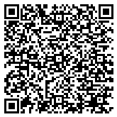
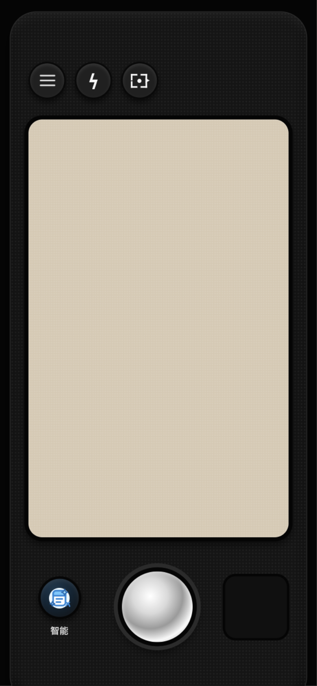
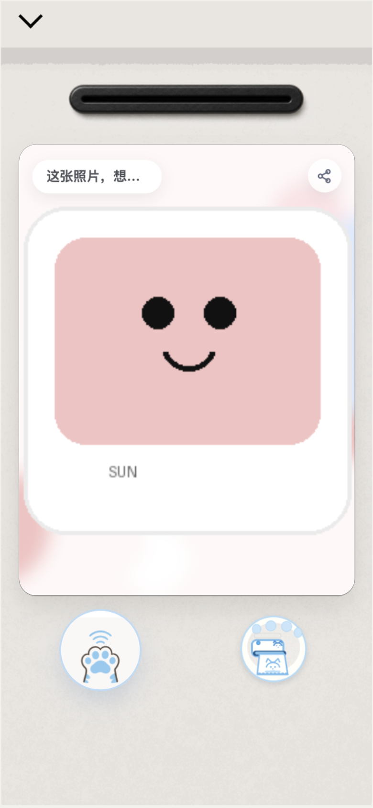
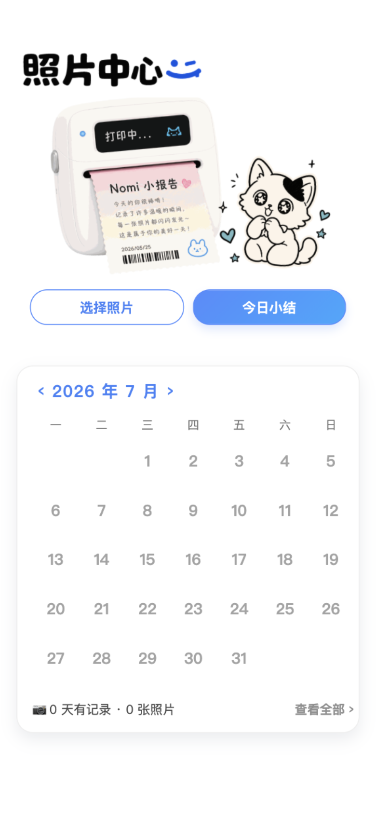
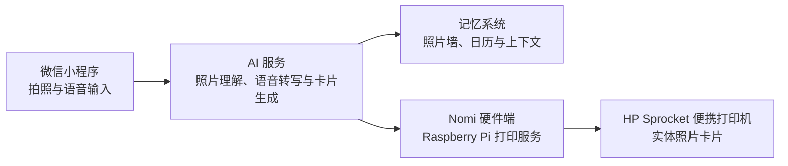

# Nomi — AI 记忆相机与实体打印体验

Nomi 是一个持续迭代中的**软硬件结合项目**：用户通过微信小程序拍照、补充语音记忆并生成个性化照片卡片；卡片既能保存在照片墙与日历中，也可以通过 Nomi 硬件端打印成实体小纸片。

> 这个公开仓库提供 Nomi 小程序的体验入口与项目展示。核心小程序、云端服务和硬件端代码目前未公开。

## 在线体验

访问：[https://liuyunlin.github.io/nomi-camera-entry/](https://liuyunlin.github.io/nomi-camera-entry/)

<p align="center">
  
</p>

## 产品体验

| 拍照与风格选择 | 记录生成与打印 | 照片中心与日历 |
| --- | --- | --- |
|  |  |  |
| 打开相机，选择智能或固定视觉模板 | 为照片补充语音记忆，生成卡片并发送打印 | 在照片中心、日历和照片墙中回看记录 |

## 为什么是软硬件结合

Nomi 不只是在手机里生成一张图片。它尝试把一段数字记忆转化为可以保存、回看和触摸的实体媒介：



### 软件端

- 微信小程序相机与视觉模板选择
- 照片理解、语音转写和记忆上下文组织
- AI 照片卡片生成
- 照片墙、日历与今日小结
- 打印设备绑定、状态反馈与失败恢复

### 硬件端

- Raspberry Pi 作为本地打印服务主机
- 统一的图片接收、任务状态与健康检查接口
- 图片裁切与打印规格适配
- 通过 Bluetooth RFCOMM 对接 HP Sprocket 200

## 核心用户路径

```text
拍照
→ 识别照片内容与时间/地点上下文
→ 可选：说一句话补充当下记忆
→ 生成个性化照片卡片
→ 保存到照片墙与日历
→ 发送至 Nomi 硬件端打印
```

## 我的工作

- 参与产品定义与软硬件体验链路设计
- 设计小程序的相机、记录生成、照片归档三段式体验
- 参与微信小程序前端实现与交互迭代
- 梳理 AI 生成、记忆上下文与远程打印之间的状态和异常反馈
- 验证 Raspberry Pi 与便携打印机的连接及打印任务链路

## 当前状态

项目仍处于原型验证和持续迭代阶段。小程序端的拍照、语音、生成、归档与打印入口已形成完整体验；硬件打印协议、稳定性和真实设备适配仍在持续验证。

## 本仓库结构

```text
nomi-camera-entry/
├── index.html                  # 小程序二维码入口页
├── assets/
│   ├── nomi-miniapp-qr.png     # 小程序二维码
│   └── screenshots/            # 前端体验截图
├── .nojekyll                   # 跳过 Jekyll 处理
└── README.md                   # 项目展示说明
```

## 本地预览入口页

```bash
python3 -m http.server 8000
```

然后访问 [http://localhost:8000](http://localhost:8000)。
